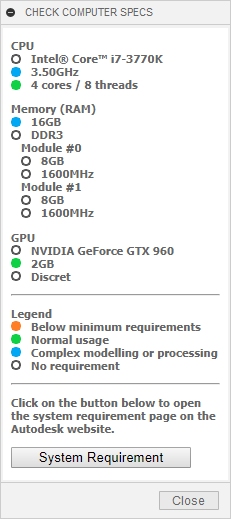
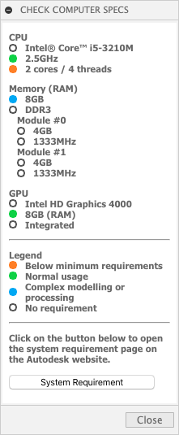

#  Fusion 360 - Check Computer Specifications

An add-in that checks computer specifications against system requirements recommended by Autodesk for Fusion 360.

|  |  |
| :---: | :---: |
| Windows | macOS |

## Installation

Download and install the **GitHub2Fusion360** add-in ([Windows](https://apps.autodesk.com/FUSION/fr/Detail/Index?id=789800822168335025&appLang=en&os=Win64) or [Mac](https://apps.autodesk.com/FUSION/fr/Detail/Index?id=789800822168335025&os=Mac&appLang=en)) available for free on the Autodesk App Store.

Run the **GitHub2Fusion360** add-in in Fusion 360 and copy/paste the URL of the repo: [https://github.com/JeromeBriot/fusion360-check-computer-specifications](https://github.com/JeromeBriot/fusion360-check-computer-specifications)

## Usage

Run the **CheckComputerSpecs** add-in and you should see a new button with an icon () on the quick access toolbar on the upper right corner of the Fusion 360 UI. Click on the button to toggle the visibility of the panel.

## Licence

Codes are licensed under the terms of the MIT License.
